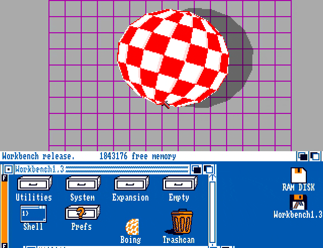

# Boing — Amiga Boing Ball, in a browser



### [Run it live in your browser →](https://mbackschat.github.io/amiga-boing-web/)

*Silent GIF preview. For full audio (the "BOING!" impacts), see [`docs/demo.mp4`](docs/demo.mp4) — same scripted sequence, with stereo sound.*

## What's in the demo

- Boing bouncing in its wireframe room above a partly-exposed Workbench 1.3 desktop.
- Drag the title bar to slide the Workbench up or down.
- Click the right-hand depth gadget (or press `Tab`) to send the Workbench fully behind Boing for a borderless full-screen demo; `Esc` or a click in the top-right corner brings it back.

## A 40-year-old demo, faithfully ported

In January 1984, Dale Luck and RJ Mical sat down the night before the Winter Consumer Electronics Show and finished a small program: a red-and-white checkered ball, bouncing inside a wireframe room, clanging in stereo every time it hit a wall. They were demoing the not-yet-named Commodore Amiga — a prototype so unfinished that its custom chips were still four boards of breadboarded TTL.

What happened next is the part everyone remembers:

> *"Because the bouncing ball animation was so fast and smooth, attendees did not believe the Amiga prototype was really doing the rendering. Suspecting a trick, they began looking around the booth for a hidden computer or VCR."*
> — Jeremy Reimer, *A History of the Amiga*

Some lifted the table skirt. There was no hidden computer. The Amiga was just *that* far ahead — full-color animation with synchronized stereo digital audio while leaving the CPU free, in 1984, on hardware that didn't officially exist yet.

Boing became Amiga's defining symbol for the next 40 years. The full story — who built it, how, why a thrown-together CES demo became a corporate identity, and the four-decade trail of reimplementations — is in [`vendor/amiga-boing/docs/DEMO-BACKGROUND.md`](https://github.com/mbackschat/amiga-boing/blob/main/docs/DEMO-BACKGROUND.md).

**This repo is a port.** Specifically, a port of the **AMICUS Disk 9** variant — the OS-respectful Commodore-Amiga re-implementation that's been fully disassembled and analyzed. Open in any modern desktop browser; no install, no server, no framework.

## Quick start

```sh
git clone --recurse-submodules https://github.com/mbackschat/amiga-boing-web
# (already cloned? git submodule update --init --recursive)
npm install
npm run dev          # local dev server at http://localhost:5173 (HMR)
npm run build        # single self-contained dist/index.html (~60 KB)
```

The disassembled Amiga source and analysis docs this port is based on live in the [`vendor/amiga-boing`](https://github.com/mbackschat/amiga-boing) git submodule (with the Amiga system includes nested one level deeper) — hence `--recurse-submodules`. They're reference-only; the build doesn't need them.

After `npm run build`, **double-click `dist/index.html`** — it runs standalone in any modern browser (Safari / Chrome / Firefox / Edge) under `file://`. No server, no `npm`, nothing else to install. The whole demo — TypeScript bundle, CSS, and the 24 KB PCM sample — is inlined into that one HTML file via [`vite-plugin-singlefile`](https://www.npmjs.com/package/vite-plugin-singlefile). Email it, drop it on a USB stick, host it as a static asset anywhere; same behavior.

## Controls

| Input | Action |
|---|---|
| First click or Space | Start the demo + resume the `AudioContext` |
| Subsequent click or Space | Toggle pause |
| `f` | Toggle fullscreen |
| Drag Workbench title bar | Pull the desktop down to expose more of it; push back up to hide |
| Click the right depth-gadget in the WB title bar | Send the desktop behind Boing (full-screen demo) |
| Click top-right corner of canvas, or `Esc` / `Tab` | Bring the desktop back |

The demo opens with a "CLICK OR PRESS SPACE TO START" overlay. Browsers gate the audio context behind a user gesture, so the first interaction unpauses the demo *and* enables audio — the first bounce is audible.

## Implementation Notes

### What makes this not just "an animated sphere"

- Static ball bitmap, "rotated" by palette cycling.
- Half-cycle-offset diagonal-spiral stripe formula.
- 5th-bitplane palette-half-toggle: the offset drop-shadow darkens to magenta over the wireframe.
- Stereo "BOING!" with both volume and inter-aural time delay.

Detail: [`specs/archive/2026-05-23-boing-browser-port.md`](specs/archive/2026-05-23-boing-browser-port.md) (§"Why this, not 'just animate a sphere'") · [`vendor/amiga-boing/docs/DEMO-BACKGROUND.md §6`](https://github.com/mbackschat/amiga-boing/blob/main/docs/DEMO-BACKGROUND.md) · [`docs/IMPLEMENTATION.md` §1–§6](docs/IMPLEMENTATION.md).

### The Workbench screen-drag

- Workbench 1.3 desktop layered behind Boing as a second screen.
- Drag the title bar to slide the desktop in or out.
- Right-hand depth gadget (or `Tab`) → Boing fully forward.
- `Esc` or click in the top-right corner → Workbench back.
- Mixed pixel densities: Boing lo-res, Workbench hi-res (Copper mid-frame mode switch).

Detail: [`docs/IMPLEMENTATION.md` §8.2 and §10.1](docs/IMPLEMENTATION.md).

### Fidelity to the source

The ball mesh, wireframe room, drop-shadow, and bounce physics are all **derived from the decoded AMICUS assembly**, not eyeballed from screenshots — every FFP constant decoded, every coordinate traced:

- **Ball mesh** — 9×56, both angle ranges, stripe formula, projection coefficients: source-exact (the `PROJ_SCALE 0.40` is provably equivalent to the source `/512`).
- **Drop-shadow** — an upright pen-1 ellipse (half-axes 55×50) offset **+25 px** right of the ball, baked into the bitmap (`globe.s` Phase A), decoded from the FFP source.
- **Bounce** — the exact source step: float `fy += trunc(vy/10)`, elastic floor reflect (`_dampy=0`), gravity last, **one step per video field**. Runs at 60 Hz (the NTSC field rate of the original 1984 demo) → ~1.6 s bounce; PAL would be 50 Hz.
- **Room** — 13 horizontals, 16 verticals, 4 floor rows, perspective fan 1.25 — byte-for-byte from `main.s .bgrenderloop`.

Full source-derived reference: [`docs/AMICUS-SOURCE-GEOMETRY.md`](docs/AMICUS-SOURCE-GEOMETRY.md) · [`docs/IMPLEMENTATION.md`](docs/IMPLEMENTATION.md) §3, §5, §6.

## Tech

- **TypeScript + Vite** (vanilla-ts template). Vite 8, TypeScript 6.
- **Canvas2D** — single 320×216 indexed framebuffer (`Uint8Array`) + 32-entry palette (`Uint32Array`) → `putImageData` every frame. CSS-scaled 4× with `image-rendering: pixelated`.
- **WebAudio** — `AudioBufferSourceNode` × 2 per impact (lead + delayed follow) → `DelayNode` → `StereoPannerNode` → `GainNode` → destination.
- No framework, no 3D library, no state-management library. Production build is a single self-contained `dist/index.html` (~60 KB with JS + CSS + Workbench PNG + PCM sample all inlined).

Full technical reference: [`docs/IMPLEMENTATION.md`](docs/IMPLEMENTATION.md).

## Source of truth

This project is a port. The completed design spec lives locally at [`specs/archive/2026-05-23-boing-browser-port.md`](specs/archive/2026-05-23-boing-browser-port.md) — read its "Notes from implementation" section for deviations and lessons collected during the port.

The canonical *upstream* sources — the disassembled AMICUS Disk 9 binary and its analysis — are in the [`vendor/amiga-boing`](https://github.com/mbackschat/amiga-boing) submodule's [`docs/`](https://github.com/mbackschat/amiga-boing/tree/main/docs):

- [`BOING-ANALYSIS.md`](https://github.com/mbackschat/amiga-boing/blob/main/docs/BOING-ANALYSIS.md) — per-function analysis of the Amiga assembly. §4 is the most useful chapter for understanding the port.
- [`DEMO-BACKGROUND.md`](https://github.com/mbackschat/amiga-boing/blob/main/docs/DEMO-BACKGROUND.md) — the full history: origin, people, variant lineage, cultural legacy.
- [`AMIGA-KNOWHOW.md`](https://github.com/mbackschat/amiga-boing/blob/main/docs/AMIGA-KNOWHOW.md) — hardware/OS reference for the registers and libraries Boing exercises.

## Credits

- Dale Luck, RJ Mical, and the original Amiga team (1984).
- Harry "Piru" Sintonen — disassembly of the AMICUS Disk 9 binary that this port follows.
- The PCM sample is the original `boing.samples` from the AMICUS disk, PD since 1985.
- The start-overlay glyphs are traced from [amigavision/TopazDouble](https://github.com/amigavision/TopazDouble) (Topaz Double Sans, MIT-licensed, © 2024 Alex Limi) — a pixel-perfect double-height recreation of the AmigaOS 2/3 Topaz typeface.
- The Workbench 1.3 screenshot (`specs/workbench/amiga1wb13.png`) and the mouse pointer sprite are reimplementations / hand-traced from a Workbench 1.3 reference image for tribute purposes; AmigaOS 1.3 is owned by Cloanto / Hyperion Entertainment.
